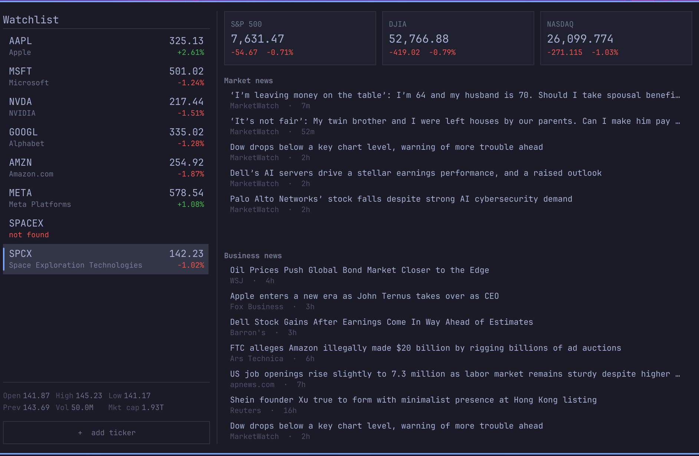
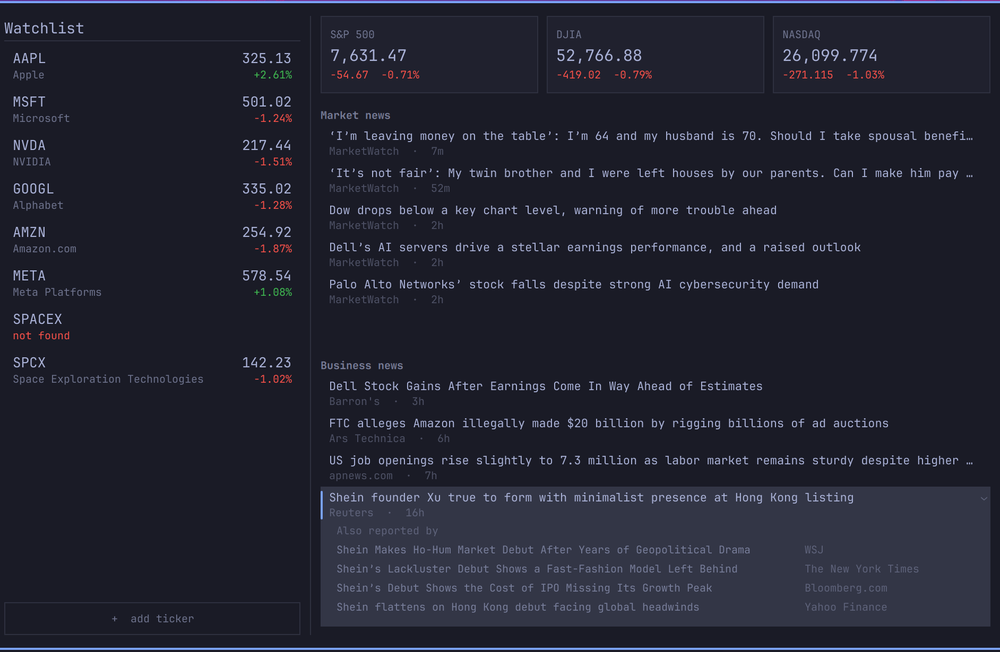

# Markets

A finance panel for the [Omarchy](https://omarchy.org) shell bar, laid out the
way Google Finance lays out its front page: your watchlist down the left, and
on the right the indexes across the top with market news and then your own
companies' news beneath.

One watchlist, one JSON file, one request per refresh.



## Install

```bash
omarchy plugin add https://github.com/Windswell284/omarchy-markets --enable
```

You will be asked which bar section to place it in. That gets you the bar
readout and the panel; **keys are a separate step** — see [Keybindings](#keybindings).

It installs under the id `pyang.finance` — that is the name to use in
`shell.json`, in `omarchy plugin` commands and in IPC calls.

```bash
omarchy plugin update pyang.finance     # pull later changes
omarchy plugin disable pyang.finance    # take it off the bar
```

## The watchlist

One list, kept as a plain JSON array at:

```
~/.config/omarchy/finance/watchlist.json
```

```json
[
  "AAPL",
  "MSFT",
  "NVDA"
]
```

It is deliberately **outside** the plugin directory. The plugin is a git
checkout, and a file that changes every time you add a ticker would leave it
permanently dirty. The file is watched, so editing it in a text editor and
editing it from the panel both work and stay in step. Point it somewhere else
with the `watchlistFile` setting if you like.

On a machine that has no watchlist yet, a starter list is written out on first
run, so the first thing you open is a file you can see and edit.

### Adding tickers

Press `a` in the panel (or click **+ add ticker**), then type either a symbol
or a company name. Matches appear above the field as you type — symbol on the
left, company on the right — and `Up`/`Down` then `Enter` takes one. Enter with
nothing highlighted uses exactly what you typed, so a symbol you already know
goes straight in without waiting for the search.

| How | |
| --- | --- |
| Press `a`, type, `Enter` | the usual way |
| Click **+ add ticker** | same field, for the mouse |
| `omarchy-shell pyang.finance add NVDA` | from a script or a key |
| Edit `watchlist.json` | for a bulk change |

Search is Nasdaq's autocomplete, which answers on partial symbols and on
company names and needs no key. It is also **slow** — 1.5 to 3 seconds of
server time per query, none of it connection overhead — which is far too slow
to sit behind a keystroke. Two things hide that:

- **Nothing is searched until the second character.** A one-character query is
  both the slowest Nasdaq answers and the least useful.
- **Every result set is cached under the query that fetched it**, and a longer
  query whose prefix is cached is answered from it instantly, re-ranked
  locally, while the network catches up. So `nvid` waits once and `nvidi`,
  `nvidia` come back immediately.

The box always says which of those it is doing — "Keep typing…", "Searching…",
"No matches for X", or "Search unavailable" — because a picker that just sits
there empty is indistinguishable from a broken one.

It ranks its own results close to
alphabetically and truncates, which buries the obvious answer — searching
`appl` puts a mutual fund called ZAPPLX above Apple, along with four different
"Applied ..." companies — so the results are re-ranked here: real companies
above funds, a matched symbol above a matched name, and, among name matches,
whichever company's first word the query covers most of. That last rule is
what puts Apple above Applied Industrial Technologies for `appl`.

ETFs and mutual funds are kept in the list, because people hold them, but
badged — a 2x leveraged tracker named after a company is otherwise
indistinguishable from the company.

One limit worth knowing: Nasdaq caps its reply at about thirty matches and
picks them alphabetically, so a short query can miss a big name entirely.
`micro` does not find Microsoft; `microsoft` finds it first.

Case does not matter, and a handful of names are understood as well as
symbols: `spx`, `nasdaq`, `djia`, `vix`, `russell`, `btc`, `eth`, `10y` and
friends all resolve to what CNBC calls them. `^GSPC` works too.

Note that **only spellings that are not themselves listed tickers** are
aliased. `DOW`, `COMP` and `GOLD` all look like index shorthand and are all
real companies — Dow Inc., Compass, Barrick Gold — so typing one gets you the
company, which is what the exchange says it means.

A symbol the quote service does not recognise is not silently dropped: the row
stays, marked "not found" in red, so a typo is visible rather than mysterious.
(That is also what a private company does — `SPACEX` has no listed ticker.)

## Keys

| Key | Does |
| --- | --- |
| `j` / `k`, `Up` / `Down` | Move within the current list |
| `Tab` / `Shift+Tab` | Next / previous list — watchlist, market news, business news |
| `o`, `Enter`, `Space` | Open the news row under the cursor in place; again closes it |
| `Left` / `Right` | Cross the gutter between the watchlist and the news stack |
| `a` | Add a ticker |
| `d` | Remove the ticker under the cursor |
| `[` / `]` | Move the ticker under the cursor up / down the list |
| `g` / `G` | First / last row of the current list |
| `r` | Refresh now |
| `Esc` | Close an open story, cancel the add field, or close the panel |

Lists with nothing in them are stepped over by `Tab` rather than landed on — an
empty news list that eats the keyboard reads as the panel having frozen.

Clicking a row selects it. Middle-clicking a watchlist row removes it.
Middle-clicking the bar icon refreshes.

**Nothing in the panel launches a browser.** There is no click, and no key,
that navigates away from the shell.

Reading more happens in place instead. A news row opens downward to show what
its feed already carried alongside the headline, which differs by feed and is
taken as it comes rather than forced into one shape:

- **Market news** shows MarketWatch's one-sentence summary of the story.
- **Business news** shows *Also reported by* — the same story from other
  outlets, with each one named. Google's feed carries that list in place of a
  summary, and it is arguably the more useful of the two: it tells you who
  else thought the story mattered.

Both arrived with the item in the original fetch, so opening a story costs no
request and reaches nowhere. Press `o`, `Enter` or `Space` on the row, or
click a row that is already selected; `Esc` or the same key again closes it.
Moving the cursor closes it too — an open row belongs to what you are reading,
not to the list.



The only hint a row carries is a small chevron, shown on the row under the
cursor and on hover. One on every row would be a column of arrows down the
side of the panel, and rows whose feed gave nothing extra do not get one at
all.

Headline links are still parsed and kept with each story. Nothing acts on
them — they are there if you ever want a copy-link or an explicit open key.

## The bar

The bar carries a chart glyph and one index's change, colored up or down:

```
󰄨 -0.68%
```

Which index is the `barSymbol` setting, defaulting to the S&P 500. Set
`showBarChange` to `false` for the glyph on its own. On a vertical bar the
readout is dropped automatically and you get the glyph either way.

## Where the data comes from

Three feeds, none of which needs an API key:

| | Source |
| --- | --- |
| Quotes | CNBC's quote service |
| Symbol search | Nasdaq's autocomplete |
| Market news | MarketWatch top stories, filtered to today |
| Business news | Google News, Business section |

The quote service takes every symbol on screen — indexes, stocks, crypto,
treasuries — in a single pipe-joined request, so the whole panel costs one
round trip per refresh no matter how long the watchlist gets. It also returns
far more than the panel shows: the open/high/low/volume strip under the
watchlist is already in the response, and costs nothing extra.

Yahoo Finance and Stooq were both tried first and neither is usable any more —
Yahoo rate-limits anonymous requests to `429`, and Stooq now sits behind a
JavaScript proof-of-work challenge.

### Why MarketWatch for market news

Market news shows **today only**, which turns out to constrain the feed
choice more than it looks. CNBC's feeds were the obvious candidates and are
the wrong shape for it: on a normal weekday afternoon their "Investing" feed
carried exactly one story filed that day, and "Finance" four. Filtering either
to today empties the section.

MarketWatch's top stories runs ten, and on the same afternoon all ten were
filed that day, so the filter costs nothing and the section stays full. The
filter is still applied rather than trusted away, because a feed that goes
stale over a weekend should show an honest "No market news yet today" rather
than Friday's headlines dressed up as the morning's.

"Today" means the reader's local day. A story filed at 21:00 Pacific is still
today's news to the person reading it, where a UTC comparison would already
have rolled over.

Set `marketNewsTodayOnly` to `false` to see the whole feed regardless of age.

### Business news

Google News' Business section, verbatim and newest first — the same front page
you would get by opening the section yourself, with the outlet named on each
row. It is not filtered against your watchlist: it is general business news,
and the watchlist has the whole left column to itself.

## Settings

All optional, all per-entry in `~/.config/omarchy/shell.json`. Find the
`pyang.finance` entry in the bar layout and add what you want:

```json
{
  "id": "pyang.finance",
  "barSymbol": ".DJI",
  "indexes": [".SPX", ".DJI", ".IXIC", "US10Y"],
  "refreshIntervalSec": 20
}
```

| Key | Default | |
| --- | --- | --- |
| `barSymbol` | `.SPX` | Which index the bar reads out |
| `showBarChange` | `true` | Whether the bar shows it at all |
| `indexes` | `.SPX`, `.DJI`, `.IXIC` | The cards across the top |
| `refreshIntervalSec` | `30` | Quote poll while the panel is open |
| `newsIntervalSec` | `600` | News poll |
| `watchlistFile` | `~/.config/omarchy/finance/watchlist.json` | |
| `marketNewsUrl` | MarketWatch top stories | Any RSS feed |
| `businessNewsUrl` | Google News Business | Any RSS feed |
| `marketNewsTodayOnly` | `true` | Drop market stories not filed today |
| `defaultTickers` | AAPL, MSFT, NVDA, GOOGL, AMZN | Seeded on first run only |
| `textScale` | `1.25` | Panel text size, 0.6–2.5 |
| `upColor` / `downColor` | `#3fb950` / `#f85149` | |

`shell.json` hot-reloads on save, so settings apply immediately.

### About the colors

Up and down are the one place this panel does not follow the theme. A red loss
and a green gain are what the numbers *mean*, not decoration, and every other
finance surface a person reads uses them. Both are settings for anyone who
disagrees or cannot distinguish them.

## How often it asks

Quotes poll every 30 seconds while the panel is open and at most once a minute
while it is shut, back off to five minutes once the market has closed, and
back off exponentially after a failed request. News is fetched lazily — a panel
you never open does not pull two RSS feeds all day — and then every ten
minutes while it is on screen.

## Keybindings

**`omarchy plugin add` does not set up keys.** It places the widget in the bar
and stops there: the plugin manifest has no way to declare a binding, and
nothing in the install path touches Hyprland. So after installing, the bar
icon works and every key inside the panel works, but nothing summons it.

```bash
cd ~/.config/omarchy/plugins/pyang.finance
./install-bindings           # SUPER+Y
./install-bindings --remove  # take it out again
```

It backs `bindings.lua` up first, refuses rather than double-binding if the key
is already spoken for, and reloads Hyprland, failing loudly if the reload
reports a config error. Running it twice is a no-op.

Or add it yourself, to `~/.config/hypr/bindings.lua`:

```lua
o.bind("SUPER + Y", "Markets", "omarchy-shell pyang.finance toggle")
```

IPC methods, for binding to keys: `open`, `close`, `toggle`, `refresh`,
`add <symbol>`, `remove <symbol>` — e.g.

```bash
omarchy-shell pyang.finance add NVDA
```

## Hacking on it

`Panel.qml` is the whole widget — bar readout, panel, all three lists, keys.
`Model.js` is the parsing, ranking and formatting: quote JSON in, RSS in,
search JSON in, flat objects out. `fetch-feed` is the transport, and exists for one reason worth knowing
before you try to remove it:

> **CNBC serves `403` to curl's default User-Agent**, on both the quote service
> and the RSS feeds. A browser User-Agent works; an empty one currently does
> too. Qt's QML `XMLHttpRequest` refuses to let a caller set `User-Agent` at
> all, which is why the panel shells out instead of fetching in-process.

`Model.js` is plain JavaScript with one QML-only line at the top, so it can be
exercised directly:

```bash
node -e 'const s=require("fs").readFileSync("Model.js","utf8").replace(/^\.pragma library\s*$/m,"");
         const M={}; new Function("x", s+"\nObject.assign(x,{parseQuotes,normalizeSymbol})")(M);
         console.log(M.normalizeSymbol("^gspc"))'
```

Two things that will otherwise waste your afternoon:

- **Run `omarchy restart shell` after editing the QML.** Saving logs
  `Local plugin changed, reloading` but does not rebuild an already-running
  widget, so your change appears not to have taken effect.
- **Inline components (`component Foo: Item {}`) cannot see this file's ids.**
  They get their own scope, so every `root.` reference inside one fails to
  resolve. The shared news row is a `Component` for exactly that reason.

## Requires

Omarchy 4.x with the Quickshell-based `omarchy-shell`, and `curl`. Both are
already on any Omarchy system.

## License

MIT — see [LICENSE](LICENSE).
